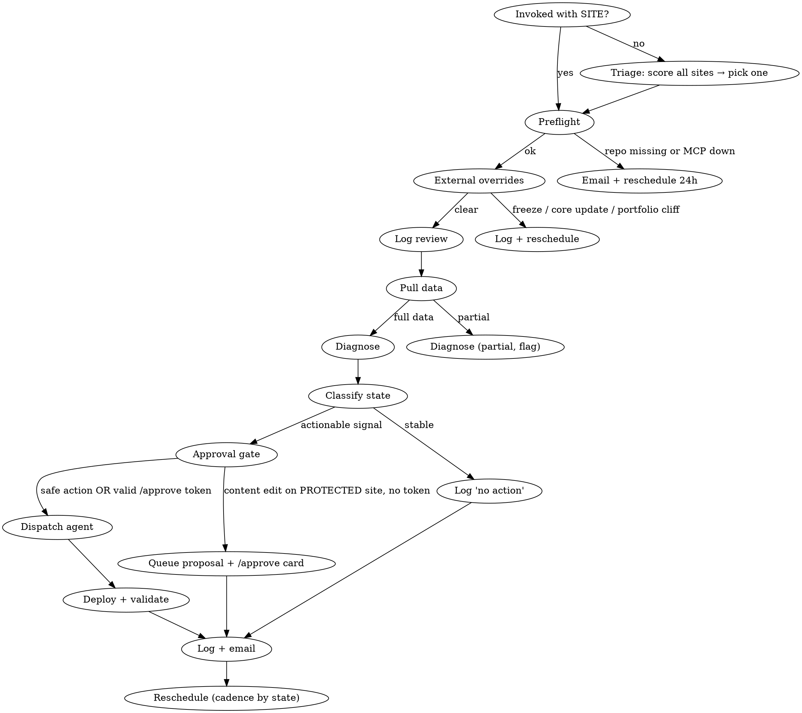

# SEO Monitor Loop

Autonomous cycle: **preflight → assess → diagnose → decide → act → validate → log → email → reschedule**.

One meaningful improvement per run. If no clear signal exists, **skip the action** and just log + reschedule. Forcing a fix when nothing is broken causes churn, recrawl waves, and false signals.

## Reference

The full implementation playbook for Steps 1–8 (data pull, diagnose, action selection, agent dispatch, deploy/validate, log, digest, reschedule) lives in `references/loop-steps.md`. **Read it once in any iteration that reaches Step 1** — i.e. any iteration that isn't skipped by Steps 0/0.3/0.5 below.

## Shadow Mode (first 14 days)

While `SHADOW_MODE: true` AND today ≤ `SHADOW_UNTIL`:
- Run Steps 0 → 3 normally (preflight, overrides, log review, data, diagnose, select action)
- **Skip Step 4 (agent dispatch) and Step 5 (deploy)**
- Write the *proposed* action to the digest with prefix `[SHADOW]` — what the loop would have done, with reasoning
- Still run Step 6 (log), Step 7 (digest), Step 8 (reschedule)
- Still respect attribution cooldown, guard rails, escalation triggers — but escalate-worthy signals become `[SHADOW] FLAG:` entries, not emails

After `SHADOW_UNTIL`, review the digest history with Sunny. If the loop's proposed actions look sane, flip `SHADOW_MODE: false` and let it run live. This is the safety check between "calibrated" and "autonomous" — prevents another Apr 10 incident from a well-meaning but miscalibrated system.

Exit criteria to flip live early: ≥ 10 triage iterations completed, zero proposed actions would have hit a guard rail, ≥ 2 proposed actions align with choices Sunny would have made manually.

## Invocation Modes

**Triage mode** — `/seo-monitor-loop` (no arg). Runs once/day at 07:00 UTC across the portfolio. Reads `C:\Users\sunny\.claude\projects\G--\memory\sites-registry.json`, scores each site by urgency, runs the per-site loop on the single highest scorer, reschedules next triage 24h. Use this as the default — one run/day beats 44 runs/day that do nothing.

Urgency score per site (sum, higher = more urgent):
- `+10` if GSC 7d clicks dropped > 30% vs prior 7d
- `+8` if site in Recovery state last iter and no proven positive delta yet
- `+6` if hit a revenue threshold (see monetize state in references/loop-steps.md)
- `+5` if last meaningful iteration > 7d ago
- `+4` if escalation flag set on last iter
- `−5` if inside attribution cooldown (< 7d since last action)
- `−10` if frozen / restricted

Skip triage and fire the per-site loop directly when: user invokes `/seo-monitor-loop [SITE]` explicitly, or a site-specific RemoteTrigger fires.

**Per-site mode** — `/seo-monitor-loop [SITE_URL]`. Runs Steps 0 → 8 below on that one site.

## Required Config (from site's CLAUDE.md or memory)

```
SITE_URL:           https://example.com
GSC_PROPERTY:       sc-domain:example.com
BING_SITE_URL:      https://example.com
REPO_PATH:          C:\Users\sunny\repos\example-site
CF_PROJECT:         example-site
GSC_MCP:            gsc-sunnypat81 | gsc-2012infinite | gsc | gsc-figment
EMAIL:              2012.infinite@gmail.com
WEEKLY_CTR_BUDGET:  20   # max pages rewritten across iterations in rolling 7d
PROTECTED:          true # live revenue site — content-mutating actions need an /approve token (Step 3.5). Default true for any site with non-zero monthly revenue or known organic traffic.
SHADOW_MODE:        true # see Shadow Mode section; flip to false after calibration window ends
SHADOW_UNTIL:       2026-05-02 # ISO date; after this, loop can deploy autonomously
```

If any field is missing, abort and email Sunny asking for it. Never guess paths or properties.

## The Loop



## Step 0 — Preflight

Before pulling data, verify:
- `REPO_PATH` exists on disk
- Git tree is clean (or existing diff belongs to this loop)
- GSC MCP connected — call `mcp__gsc-sunnypat81__list_properties` first as a health check (use `mcp__gsc-2012infinite__*` for 2012.infinite@gmail.com properties). **GSC MCP is confirmed working as of Apr 19 2026 — do NOT flag as disconnected unless the call actually fails.**
- CF token + project resolved from `master-builds.md`
- Playwright MCP available for local sessions (tools: `browser_navigate`, `browser_take_screenshot`, `browser_console_messages`, `browser_evaluate`, `browser_snapshot`, `browser_network_requests`) — used in Step 5 visual validation. Not available in RemoteTrigger agents — those use curl only.

If GSC MCP is unresponsive (call fails with error, not just empty result), email Sunny: *"GSC MCP down — reconnect needed. Skipping [SITE] iteration N."* Reschedule 24h. Do not continue.

## Step 0.3 — External Overrides

Three checks. Any one forces a restricted or skipped iteration — these matter more than anything the loop itself can see.

| Check | How | On trigger |
|-------|-----|------------|
| **Site freeze** | Site's `MEMORY.md` entry contains `FREEZE until YYYY-MM-DD` | Skip to Step 6. Log `frozen: [reason]`. Reschedule to unfreeze date. |
| **Core Update window** | Today within a window in `known-core-updates.json` | State → `restricted`. Only technical actions (redirects, schema, IndexNow). Block all CTR / title / meta / content edits. |
| **Portfolio cliff** | Last 3 days of `seo-monitor-log.md` across all sites: 3+ cliffs (>50% impr drop) on same day | External event likely. Block content + CTR actions this iter. Log `external cliff suspected: [date]`. |

Maintain `C:\Users\sunny\.claude\projects\G--\memory\known-core-updates.json` (one-line entries):
```json
[{"name":"Mar 2026 Core Update","start":"2026-03-05","end":"2026-04-02"}]
```

## Step 0.5 — Log Review (learn from prior iterations)

Read the last 10 entries for this site from `seo-monitor-log.md`. Extract:

| Pattern | What it means | How it biases this iteration |
|---------|---------------|------------------------------|
| Same action attempted 2+ times, signals unchanged | Action isn't working — stop trying it | Drop it from Step 3 ranking; go to next-ranked action |
| Action → positive delta in clicks/position within 2 iterations | Action works for this site | Prefer it for similar signals in future |
| Action → negative delta (signals worsened) | Action actively harmful here | Blacklist for this site until manually cleared |
| 3+ "stable-no-action" in a row | Loop genuinely serves no purpose | Widen cadence to 7d (Step 8) |
| Validation score < 85 recurring | Agent quality drifting | Flag in email; may need `/simplify` or skill audit |
| Same URL pattern repeatedly flagged | Structural issue, not content | Escalate — needs Sunny architectural decision |
| Weekly CTR budget trending to exceed | About to hit guard | Defer CTR action; pick next-ranked |
| MCP/deploy failures 2+ in a row | Infra issue, not SEO | Escalate |

Write findings into a **Prior-iteration learnings** block in the log entry. Pass them into the Step 4 agent brief as additional context:

```
Prior learnings for this site:
- Tried: [action] × N times, signal delta: [±X%] — [status: blacklisted | proven | inconclusive]
- Last positive delta: [action] on [ISO date] (+X clicks/7d)
- Avoid this iteration: [blacklisted actions]
```

If log has fewer than 3 prior entries, skip this step — not enough data.

**Attribution cooldown:** if last iteration's action was < 7 days ago, do NOT compute a signal delta for it — mark `pending`. Google recrawl is 3–14d; earlier measurement produces false blacklists and false wins. Same URL set cannot receive a second action until 7d passed.

**Skip-if-no-change fast path:** if state + key signals (clicks, avg position, InIndex, CTR band) are all within ±3% of the last iteration AND we're inside attribution cooldown, skip Steps 1–5 entirely. Write a one-line digest entry `unchanged — cooldown` and reschedule. No data pull, no diagnosis, no tokens wasted on inaction.

## Steps 1–8 — Implementation

**Read `references/loop-steps.md`** — full playbook for: data pull, diagnose, action selection (with state-specific playbooks), agent dispatch brief, deploy + validate (incl. auto-rollback), log iteration (incl. playbook write), portfolio digest, reschedule cadence.

After Step 0.5 decided to proceed, that file is your execution guide.

## Guard Rails (non-negotiable)

| Rule | Source |
|------|--------|
| CTR rewrites: max 5 pages/iter, max 20/week across iterations, never on >500-page programmatic templates | feedback_ctr_rewrite_guard — Apr 10 triple-collapse |
| Never bulk-rewrite titles/metas on multiple sites in the same week | Same |
| Never overwrite existing WP pages via REST — drafts only | feedback_never_overwrite_wp |
| Deploy via GitHub → wrangler, never direct upload | feedback_autonomous_deploy |
| StaticForms key always `sf_9e906eb6c00416b9d3354749` | feedback_staticforms_key |
| No ads/monetisation until traffic stable | feedback_no_premature_adsense |
| Content-mutating actions (CTR/title/meta rewrite, content_enrich, refresh, new content) on a `PROTECTED` site require an `/approve` TTL token before dispatch — never auto-shipped (Step 3.5) | shecookssheeats enrichment collapse, May 23 |
| `content_enrich` / content rewrite is blocked entirely while a PROTECTED site is in **Recovery** state or within **14d of a cliff** — token cannot override | Same + Quick Diagnosis cliff rule |
| A second content-mutating cycle on the same PROTECTED site needs a **fresh** token even if the first was approved — approval is per-action, never standing | Step 3.5 |
| `/pre-completion-validation` mandatory before claiming done | feedback_pre_completion_validation |
| Absolute ISO dates in every log entry | auto-memory rule |

## Quick Diagnosis Reference

**Cliff drop (>50% impressions in <7d):** algorithmic quality action. Do NOT touch content first. Fix technical trust signals (redirects, sitemap, schema, author/org markup). Wait 14d before content changes.

**Gradual position drift (+5 to +15 over 2w):** templated-content signal. Fix: unique intros on top hubs, noindex thin pages.

**CTR collapse without position change:** stale titles/metas or SERP snippet redesign. Fix: targeted CTR rewrites on affected pages only.

**Bing InIndex shrinking, Google stable:** Bing-specific crawl issue. Fix: IndexNow push, crawl settings check, robots.txt audit.

**Impressions up, clicks flat:** CTR or brand-recognition gap. Fix: title rewrites, schema for rich results.

**GSC MCP disconnected:** never guess data. Email Sunny, skip iteration.

## Escalation

Pause autonomous mode and email Sunny with `ESCALATE:` prefix if ANY:
- 3+ consecutive iterations with negative clicks trend and no recovery
- Weekly CTR budget exceeded
- Same action attempted 2+ times with no signal improvement
- `/pre-completion-validation` score < 70 on two consecutive iterations
- Deploy failed twice in a row
- GSC MCP down for 2+ iterations

When escalated, do not `ScheduleWakeup` — wait for Sunny's call.

## Weekly Review (every 7th iteration)

- Run 28d comparison (not 7d)
- Bing `get_crawl_issues` full scan
- Review log for recurring patterns / repeatedly-failing actions
- Recompute rolling WEEKLY_CTR_BUDGET usage
- Write a 3-line summary into the log under `### Weekly review — [ISO date]`
