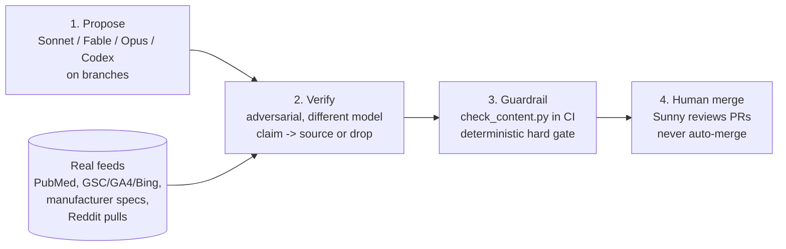

# Portfolio improvement pipeline (design)

Status: proposal for review. Nothing here runs on a schedule yet. Written after
the 2026-07-26 UX audit, in which every audited affiliate site scored NO-GO.

## The problem this has to solve, not repeat

The audit's finding was not "the sites need more content". It was that
autonomous content generation had manufactured fabrication across the whole
portfolio: invented studies, a fictional GP reviewer wired into schema, PMIDs
that resolve to unrelated papers, fake lab tests, "we tested for 8 weeks" on
pages with no test. So the design rule is blunt:

> More generation is the accelerant, not the fix. The value is in the verify
> and guardrail layers. Automation may fix structure and reframe claims to be
> honest. It may never invent substance (test data, product photos, verified
> quotes). If a claim cannot be sourced, the honest edit removes it.

## Four layers

### 1. Propose (writes branches, never main)

Division of labour by strength:

| Agent | Best at | Example work on this portfolio |
|-------|---------|-------------------------------|
| Sonnet | high-volume mechanical | dash sweeps, `rel` attributes, schema hygiene, scanning |
| Fable / Opus | judgment on truth and YMYL | delete-vs-reword a health claim, verdicts on fabrication |
| Codex | code-level structural fixes | techloved's broken hub nav, missing pages, schema restructuring |

Cross-vendor is deliberate: it breaks correlated errors in layer 2.

### 2. Verify (the layer that was missing)

Every factual claim a proposer emits is checked against a real source by a
different model than wrote it, or it is dropped. No claim survives without a
`file:line` anchor and a source reference.

- health citations -> PubMed (a PMID must resolve to the cited title)
- towing / product specs -> manufacturer tow guides and spec sheets
- UGC quotes -> the real thread, with username + permalink + date
- performance claims -> the GSC/GA4/Bing snapshots Hermes already pulls

This is where Hermes stops being only a data puller: the snapshots on the
`hermes-snapshots` branch become the evidence base the verify pass reads.

### 3. Guardrail (already built, `hermes/guardrail/`)

`check_content.py` runs in CI on every proposed PR and hard-fails on dashes,
git conflict markers, and persona/Person schema. Deterministic, offline, no
model in the loop. This is the floor no PR can go under.

### 4. Human merge gate

Sunny reviews and merges. Never auto-merge. These are honesty fixes, not
refactors, which is why the standing instruction has always been "branches
only, I merge".

## What automation may and may not do

| May (safe) | May not (this is what broke the sites) |
|-----------|----------------------------------------|
| Fix schema, tables, nav, internal links | Invent studies, statistics, or survey Ns |
| Sweep dashes, fix `rel`, add disclosures | Invent author personas or credentials |
| Reword "we tested" into "owners report" | Claim hands-on testing that did not happen |
| Remove an unsourceable claim | Write product photos or fabricate images |
| Add a quote that has a real permalink | Paraphrase and present as a verbatim quote |

## Infrastructure

- Secrets (GitHub Actions): `ANTHROPIC_API_KEY`, `OPENAI_API_KEY` (Codex),
  `PORTFOLIO_PAT` (fine-grained, contents:write + pull_requests:write on the
  site repos; `GITHUB_TOKEN` cannot reach other repos).
- Workflows in this repo: `content-guardrail.yml` (layer 3, reusable) and
  `ux-audit.yml` (layers 1 and 3 today). The extension adds a Codex propose
  job and a layer-2 verify job to `ux-audit.yml`.
- Site repos adopt the guardrail with a 6-line caller workflow (see
  `hermes/guardrail/README.md`).

## Rollout, deliberately slow

1. Dispatch-only. No schedule until verify + guardrail are proven.
2. Prove on two repos first (thebestmowers and towrating are already clean, so
   they are the regression baseline; run against one still-broken repo to prove
   the verify pass catches what a lone proposer would wave through).
3. Only then widen the matrix, and only then consider a schedule.

## Cost

Dozens of repos * four models * frequent runs is real spend. Pace it: run the
deterministic guardrail freely (no token cost), gate the model layers behind
manual dispatch, and scope each run to changed files where possible.

## Open decisions for Sunny

- Approve the two API-key secrets and the PAT scope.
- Confirm the human-merge gate stays (recommended: yes, indefinitely).
- Pick the first non-clean repo to prove the verify pass against.
